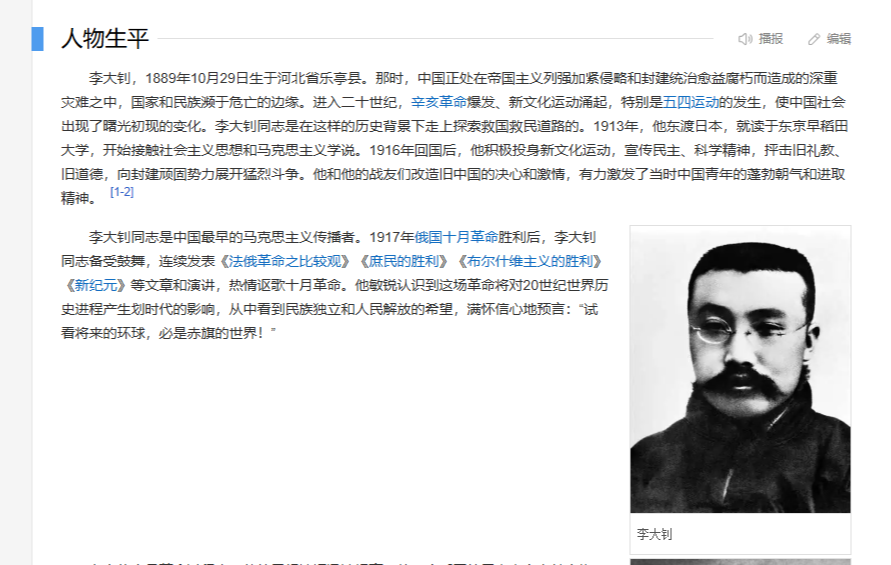
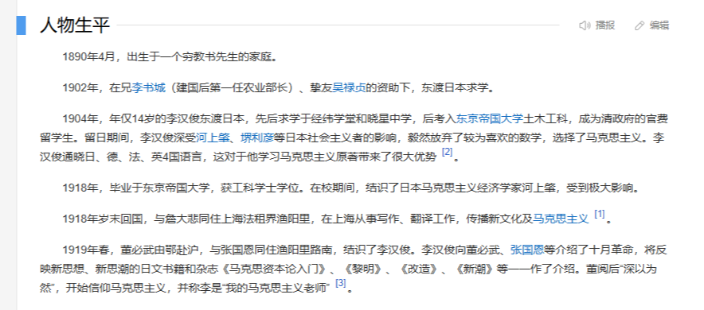

# 第一章 中国共产党思想的起源

> 中国大陆的历史课本刻意隐瞒了共产主义在中国的传播过程，好像俄国的十月革命一爆发，共产主义思潮在中国就广泛传播了一样。

---

## 1.1 早期共产主义人士的经历

> ### 早期共产主义运动人士名单
> 
> **注**：姓名**加粗**的为有日本留学经历的人士，姓名为*斜体*的为有苏联工作或留学经历的人士
> 
> **陈独秀**、俞秀松、**李汉俊**、陈公培、**陈望道**、沈玄庐、*杨明斋*、施存统、**李达**、**邵力子**、沈雁冰(茅盾)、**林祖涵**、李启汉、袁振英(香港人)、李中、沈泽民、**周佛海**、**李大钊**

 图 1.1.1 -  <a href="https://baike.baidu.com/item/%E9%99%88%E7%8B%AC%E7%A7%80#1-1">百度百科</a>上关于陈独秀的留学经历 

 图 1.1.2 -  <a href="https://baike.baidu.com/item/%E6%9D%8E%E5%A4%A7%E9%92%8A/115618#1">百度百科</a>上关于李大钊的留学经历（描述并不具体） 

 图 1.1.3 -  <a href="https://baike.baidu.com/item/%E6%9D%8E%E6%B1%89%E4%BF%8A/26412#1">百度百科</a>上关于李汉俊的留学经历 

