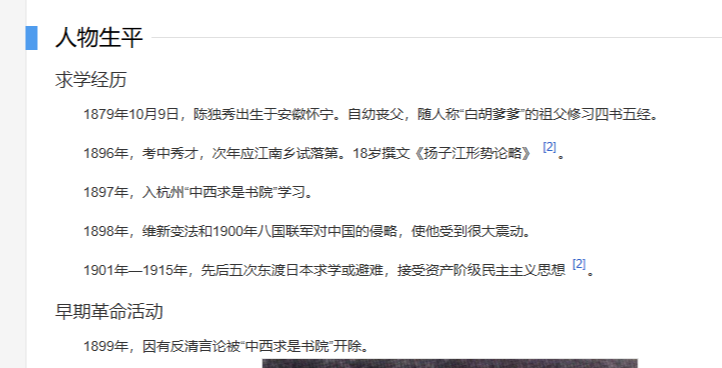
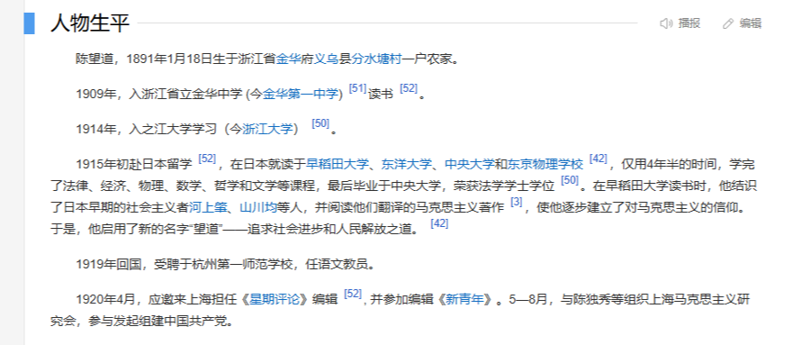
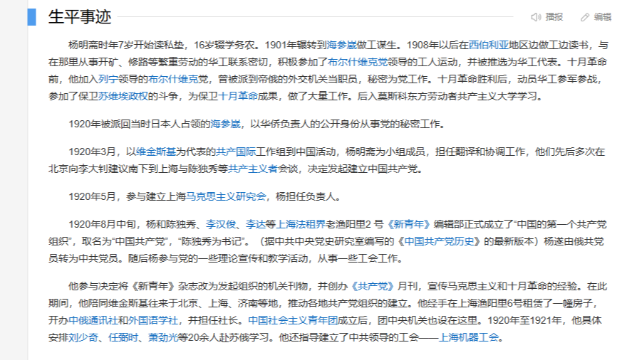
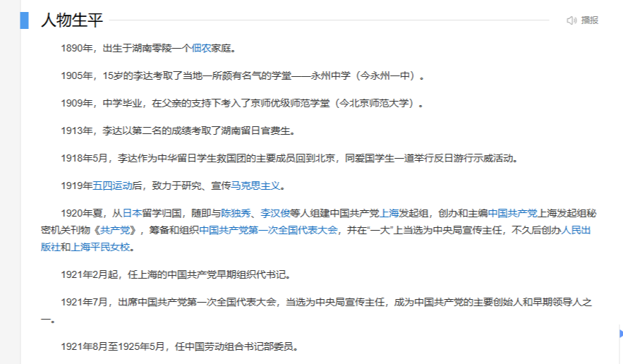
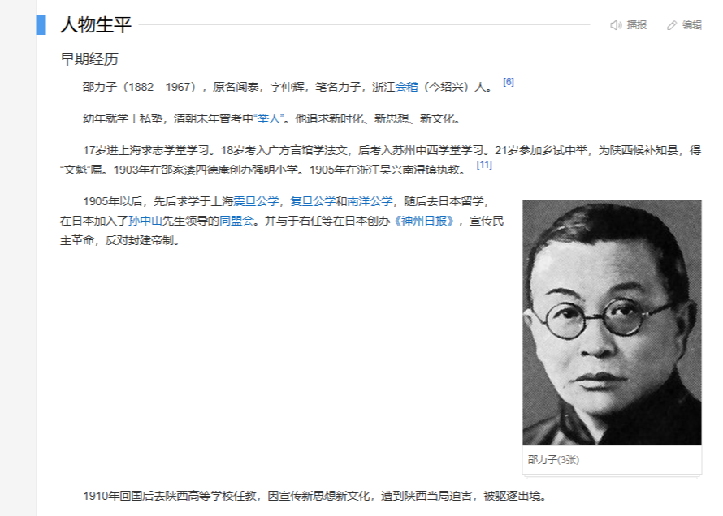

# 第一章 中国共产党思想的起源

> 中国大陆的历史课本刻意隐瞒了共产主义在中国的传播过程，好像俄国的十月革命一爆发，共产主义思潮在中国就广泛传播了一样。

---

## 1.1 早期共产主义人士的经历

> ### 早期共产主义运动人士名单
> 
> **注**：姓名**加粗**的为有日本留学经历的人士，姓名为*斜体*的为有苏联工作或留学经历的人士
> 
> **陈独秀**、俞秀松、**李汉俊**、陈公培、**陈望道**、沈玄庐、*杨明斋*、施存统、**李达**、**邵力子**、沈雁冰(茅盾)、**林祖涵**、李启汉、袁振英(香港人)、李中、沈泽民、**周佛海**、**李大钊**

以下列举七个有国外留学经历的共产主义运动人士的详细信息，姓名未加粗的为从未去国外留学的人士，有关他们的信息请自行了解。

 图 1.1.1 -  <a href="https://baike.baidu.com/item/%E9%99%88%E7%8B%AC%E7%A7%80#1-1">百度百科</a>上关于陈独秀的留学经历 

 图 1.1.2 -  <a href="https://baike.baidu.com/item/%E6%9D%8E%E5%A4%A7%E9%92%8A/115618#1">百度百科</a>上关于李大钊的留学经历（描述并不具体） 

 图 1.1.3 -  <a href="https://baike.baidu.com/item/%E6%9D%8E%E6%B1%89%E4%BF%8A/26412#1">百度百科</a>上关于李汉俊的留学经历 

 图 1.1.4 -  <a href="https://baike.baidu.com/item/%E9%99%88%E6%9C%9B%E9%81%93#1">百度百科</a>上关于陈望道的留学经历 

 图 1.1.5 -  <a href="https://baike.baidu.com/item/%E6%9D%A8%E6%98%8E%E6%96%8B/6746413#1">百度百科</a>上关于杨明斋的留学和工作经历 

 图 1.1.6 -  <a href="https://baike.baidu.com/item/%E6%9D%8E%E8%BE%BE/16569460#1">百度百科</a>上关于李达的留学经历 

 图 1.1.7 -  <a href="https://baike.baidu.com/item/%E9%82%B5%E5%8A%9B%E5%AD%90/8692683#1">百度百科</a>上关于邵力子的留学经历 

从以上信息可以看出，大多数接受共产主义思想的人士都曾经去日本留学，而非去俄国和东欧国家，另外共产主义的第一个信徒并不是诸如陈独秀等人，而是梁启超。

